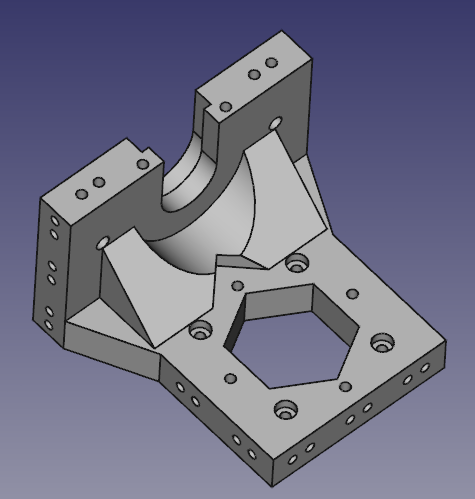

# cadquery-models

Collection of 3D models (mostly related to 3D printing) made using [cadquery](https://github.com/dcowden/cadquery) - best scripted CAD using OpenCASCADE and python.

## Prusa i3 extruder support

This is an experimental extruder support for a Prusa i3 / P3Steel 3d printer.

This part is inspired by [Toolson](http://scheuten.me/?p=506).
